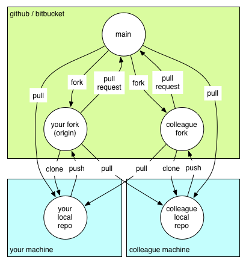

# Git workflow

## Overview

The git workflow for this project is a hybrid between the [gitflow](http://nvie.com/posts/a-successful-git-branching-model/) 
and the [github workflow](https://guides.github.com/introduction/flow/).  The `master` branch always represents
the latest release, and the `develop` branch represents changes accepted for the next release.  These are the only 
two branches in the main repo.  All developer work is performed in a task-specific branch within their forked repo, and 
pull requests are used to propose additions to `develop` in the main repo.

Branch names are prefixed with `bug/`, `feature/`, `refactor/`, `improvement/`, or some other descriptor of the work.

The following image illustrates how information moves around between repos, and the naming scheme in the image is used
in the case studies below.

                 
## Use Case: Setup

* **Fork**:  Fork the main project repository to your github/bitbucket account.
* **Clone**: Clone your copy of the repo to your development machine.

    `git clone <repo URL>`
* **Setup remote for main**: Set up a remote for the `main` project repo.

    `git remote add main <repo URL>`
    
    In all our examples, we assume the remote `main` refers to the main repo of the project 
    (It is common to name this remote `upstream`, but we find this overloading uncessarily
    confusing).
* **Fetch Branches**: Since we will always base our work on the `develop` branch of the `main` repo,
    we will want to have a local copy.
     
    `git fetch main`

## Use Case: Single-User task

* **Branch**: Checkout the `develop` branch from the main repo as a new local branch.

    `git checkout -b <new branch name> main/develop`    
* **Update**: Ensure you have the current version of the main repository (In case code has been accepted into `main` since your last fetch).  

    `git pull main develop`
* **Work**: Do your work, and commit.  We expect commit messages to following the [7 rules of great commit messages](http://chris.beams.io/posts/git-commit/#seven-rules)
* **Push**: Push your work to your github/bitbucket repo

    `git push origin <branch name>`
* **Create a pull request**:  Your pull request goes from your branch to the `develop` branch.  
     * [github](https://github.com/blog/1943-how-to-write-the-perfect-pull-request)
     * [Mark Seemann](http://blog.ploeh.dk/2015/01/15/10-tips-for-better-pull-requests/)
     
     You should expect your pull request to be a dialog about your work.  If changes are required, when you
     perform another push to `origin` the pull request will automatically be updated.
    
    
## Use Case: working with a colleague

If you are working with another developer, you can use your github/bitbucket repo.  Each pushes to `origin` to
make code available.  To obtain your colleague's code, instead of creating a pull request do the following.
    
* **Setup Remote**: Create a remote for your colleague's github/bitbucket repo (here we use `colleague` as the
    name of the remote.

    `git remote add colleague <repo URL>`

* **Fetch branches**: Fetch the branches in your colleague's repo

    `git fetch colleague`
    
    You can see all branches with `git branch -a`

* **Check out branch**: Check out the shared branch

    `git checkout <shared branch name> colleague/<shared branch name>`
    
    
Once you and your colleague are working on the same branch, you can both `push` to `origin` and pull from `colleague`
until you are ready to create a pull request from one of the accounts.

## Notes

* All developers fork and submit pull requests (no elevated status for product owners).  This ensures that the `main`
    repo only contains two branches, `master` and `develop`.
